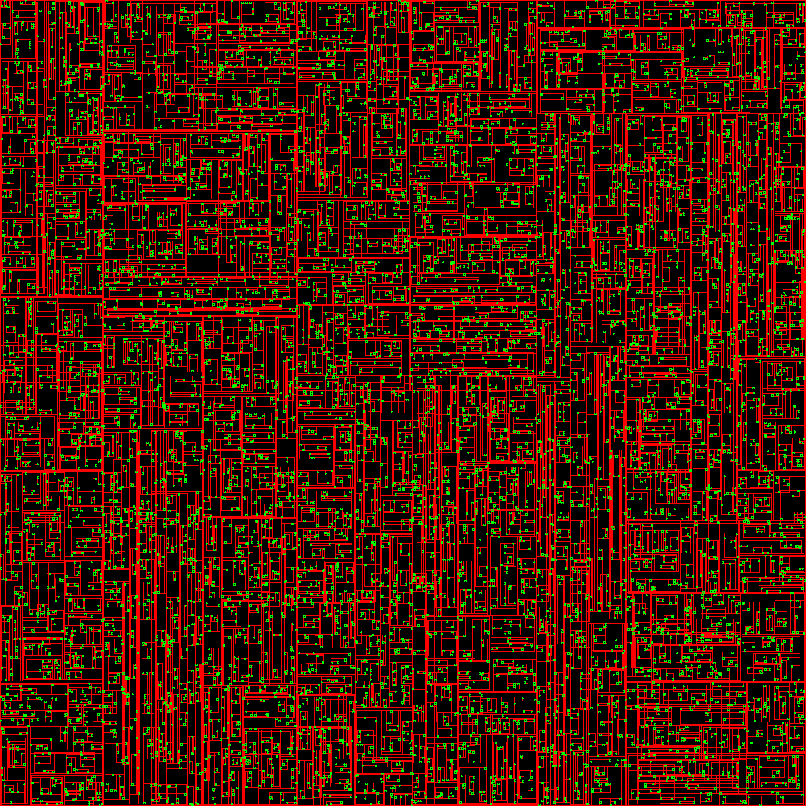

# dyntree
A Dynamic BVH (Bounding Volume Hierarchy) using incremental refit and tree-rotations

This is a Go port of https://github.com/jeske/SimpleScene/tree/master/SimpleScene/Util/ssBVH

## Warning
This is a very WIP translation of the C# implementation. There are likely bugs, and certainy not enough testing coverage to catch them. Any and all pull requests are appreciated as I move to make this library more stable.

## Areas of focus
 - Thread-Safe access (hopefully parallel eventually)
 - Experimenting with allocationless strategies
 - Better test coverage

## Images
[Benchmark Results](tree_test.go#L168)

Graphical representation of a tree (red=boundary,green=entity):

